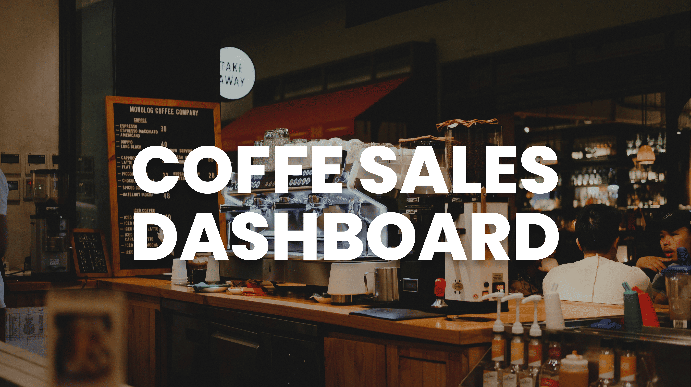

  
Banner <a href="https://unsplash.com/photos/woman-sitting-beside-front-desk-of-cafe-1BEAIg-79H0" target="_blank">source</a>


Badge <a href="https://shields.io/" target="_blank">source</a>

# Coffee Sales Dashboard: Dataset

<!-- Authors -->
<!-- ## Reference
- Learn 80% of Data Analysis in Excel in Just 12 Minutes ( https://www.youtube.com/watch?v=O1QfG5SXRkM) -->

## Table of Contents

  - [Coffee Sales Dashboard: Dataset: Total Sales - Chart, Country, Top Customer, Orders and Slicer](#coffee-sales-dashboard-dataset-total-sales-country-top-custoemr-orders-slicer)
  - [Table of Contents](#table-of-contents)
  - [Business Problem](#business-problem)
  - [Data source](#data-source)
  - [Methods](#methods) 
  - [Tech Stack](#tech-stack)
  - [Summary of Key Results](#summary-of-key-results)
  - [Lessons Learned and Recommendation](#lessons-learned-and-recommendation)
  - [Limitation and What Can Be Improved](#limitation-and-what-can-be-improved)
  - [Run Locally](#run-locally)
  - [Repository Structure](#repository-structure)
  - [Contribution](#contribution)
  - [License](#license)

## Business Problem
This project focuses on key steps in the Data Analysis process: Cleaning, Transforming, Analyzing, and Visualizing data, using the Coffee Sales dataset, which includes metrics such as Total Sales, Country, Top Customer, Orders, and Slicer filters.

The goal is to demonstrate how to work with real-world datasets by:

• Cleaning the data: removing duplicates and addressing inconsistencies in sales records. 

• Transforming the data: standardizing terminology and creating calculated metrics for deeper insights. 

• Analyzing the data: generating pivot tables to rank top-performing products, customer segments, and sales by country, while implementing slicers for dynamic filtering.

• Visualizing the results: producing charts to showcase total sales, customer trends, order patterns, and regional performance.

This workflow exemplifies essential Data Analysis skills, enabling informed decision-making and strategic growth for the coffee business.

## Data Source

- The ONLY EXCEL PORTFOLIO PROJECT YOU NEED
(https://www.youtube.com/watch?v=m13o5aqeCbM)

## Methods

- Data Cleaning
- Data Transformation
- Pivot Table Analysis
- Slicer Implementation
- Data Visualization 
- Exploratory Analysis
- Dashboard Design Principles

## Tech Stack

- Microsoft Excel
  - Data Cleaning (Remove Duplicates, Handling Missing Data)
  - Formulas & Functions (e.g., VLOOKUP, IF Statements)
  - Pivot Tables for Analysis
  - Slicers for Filtering
  - Charting & Data Visualization


## Summary of Key Results

<!-- <div align="center">
  <h4>Dashboard</h4>
  
  
  <h4>Working Sheet</h4>
  
  
  <h4>Athlete vs. Team Participation Count</h4>
  
  
  <h4>Discipline Distribution with Count and Percentage</h4>
  
  
  <h4>Olympic Medal Count by Country (Beijing 2022 & Tokyo 2020) with Game Filter</h4>
  
  
  <h4>Stacked Chart Medal Count by Country (Gold, Silver, Bronze)</h4>
  
</div> -->

## Lessons Learned and Recommendation

- During this project, I learned the importance of organizing the data analysis workflow using Microsoft Excel. Cleaning the data by removing duplicates and standardizing entries ensured consistency, while transforming the data through calculated fields provided deeper sales insights. Pivot tables proved invaluable for summarizing data, revealing trends like top-performing products, and slicers enabled dynamic filtering for focused analysis. Finally, Excel's charting tools allowed me to create clear, accessible visuals that effectively communicated the findings.

- I recommend continuing to leverage Excel’s powerful features for future projects while exploring advanced formulas and visualization options to enhance analysis. Regularly updating dashboards and tailoring visualizations to stakeholder needs can further support informed, data-driven decision-making.

## Limitation and What Can Be Improved

- Scalability: While Excel is effective for small to medium datasets, working with larger datasets can be challenging due to performance constraints. Exploring specialized tools like Power BI or Tableau could offer improved scalability, dynamic filtering, and more advanced visualization capabilities. Integrating such platforms into future projects would greatly enhance the analytical depth and interactivity of dashboards.

## Run Locally
Initialize git

```bash
git init
```


Clone the project

```bash
git clone https://github.com/johncanero/olympics_dataset_john_canero.git
```

enter the project directory

```bash
cd olympics_dataset_john_canero
```

Open in Visual Studio Code

```bash
code .
```

## Repository Structure


```
├── assets
│   ├── Banner_Olympics_Dataset.png       
│   ├── PivotTable_CountType_AthleteVsTeam.png         
│   ├──PivotTable_DisciplineDistributionCount_Percentage.png              
│   ├── PivotTable_OlympicMedalCountByCountry_GameFilter.png  
│   ├── PivotTable_StackedChartMedalCount_Country.png          
│
|
├── 01_olympics_dataset_john_canero.xlsx
│ 
│
├── README.md                     
│
│
```

## Contribution

Pull requests are welcome! For major changes, please open an issue first to discuss what you would like to change or contribute.

## License

MIT License

Copyright (c) 2022 Stern Semasuka

Permission is hereby granted, free of charge, to any person obtaining a copy
of this software and associated documentation files (the "Software"), to deal
in the Software without restriction, including without limitation the rights
to use, copy, modify, merge, publish, distribute, sublicense, and/or sell
copies of the Software, and to permit persons to whom the Software is
furnished to do so, subject to the following conditions:

The above copyright notice and this permission notice shall be included in all
copies or substantial portions of the Software.

THE SOFTWARE IS PROVIDED "AS IS", WITHOUT WARRANTY OF ANY KIND, EXPRESS OR
IMPLIED, INCLUDING BUT NOT LIMITED TO THE WARRANTIES OF MERCHANTABILITY,
FITNESS FOR A PARTICULAR PURPOSE AND NONINFRINGEMENT. IN NO EVENT SHALL THE
AUTHORS OR COPYRIGHT HOLDERS BE LIABLE FOR ANY CLAIM, DAMAGES OR OTHER
LIABILITY, WHETHER IN AN ACTION OF CONTRACT, TORT OR OTHERWISE, ARISING FROM,
OUT OF OR IN CONNECTION WITH THE SOFTWARE OR THE USE OR OTHER DEALINGS IN THE
SOFTWARE.

Learn more about [MIT](https://choosealicense.com/licenses/mit
